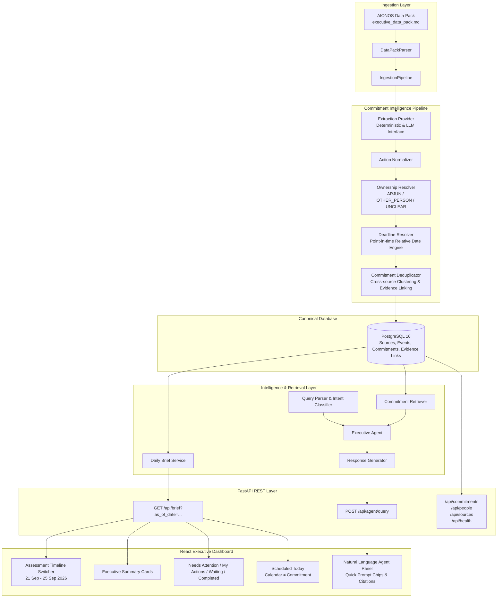

# Executive Productivity Agent

An evidence-grounded executive productivity agent that converts scattered meetings, emails, voice notes, and calendar information into canonical commitments, daily action briefs, and natural-language answers for **Arjun Malhotra, VP Sales**. The primary objective is to identify commitments made across disparate channels, resolve accountable ownership, track evolving deadlines, deduplicate repeated references, surface unclear ownership rather than inventing it, answer executive questions backed by verbatim source evidence, and strictly keep calendar events separate from action commitments.

---

## 1. Problem Statement

Modern executives operate across fragmented communication streams where obligations, deliverables, and requests accumulate invisibly across multiple channels:

- **Distributed Information:** Critical commitments are scattered across executive leadership sync transcripts, multi-party email threads, personal voice notes, and team calendars.
- **Evolving Commitments:** Commitments rarely stay static. A deliverable promised during a Monday morning sync may be renegotiated over email on Tuesday, pushed back in a voice memo on Wednesday morning, and finally delivered Wednesday evening.
- **Duplicate & Cross-Channel References:** The same underlying deliverable (e.g., sending an updated vendor list) appears repeatedly across meetings, email follow-ups, and self-reminders with changing temporal expressions ("tomorrow", "Wednesday morning", "today").
- **Unclear & Disputed Ownership:** Tasks are frequently discussed without explicit assignment. For example, during executive syncs or email threads, administrative obligations (such as office lease renewals) may sit between Facilities and Sales without an assigned owner. Naive AI systems invent owners or default to the executive; real-world systems must detect and flag ownership ambiguity.
- **Shifting Deadlines & Overdue Detection:** Relative dates ("by end of day tomorrow", "before Thursday prep") require deterministic temporal anchors to evaluate whether an item is on track, due today, or overdue relative to a point in time.
- **Calendar Conflation:** A calendar event (e.g., a scheduled Zoom meeting) is temporal context, not a promise. Confusing a calendar slot with an executive commitment causes hallucinated obligations.
- **Executive Need:** Leaders require a singular, trustworthy, action-oriented daily brief that answers: *What do I need to do? What am I waiting on others for? What is at risk? What does my schedule look like today?*

---

## 2. Solution

The Executive Productivity Agent implements a deterministic, multi-stage intelligence pipeline grounded in the supplied assessment Data Pack, with **PostgreSQL** serving as the canonical source of truth:

```text
Raw Sources (Markdown / Transcripts / Emails / Voice Notes / Calendars)
   │
   ▼
[1] Ingestion Layer (DataPackParser + IngestionPipeline)
   │
   ▼
[2] Commitment Extraction (Generic Linguistic Extraction & Provider Interface)
   │
   ▼
[3] Action Normalization (ActionNormalizer)
   │
   ▼
[4] Ownership Resolution (OwnershipResolver — Arjun vs Other vs Unclear)
   │
   ▼
[5] Deadline Resolution (DeadlineResolver — Temporal parsing relative to source timestamp)
   │
   ▼
[6] Deduplication (CommitmentDeduplicator — Cross-channel semantic clustering & evolution tracking)
   │
   ▼
PostgreSQL 16 Database (Canonical Commitments & Evidence Links)
   │
   ├────────────────────────────────────────┐
   ▼                                        ▼
[7] Commitment Retriever            [8] Daily Brief Service
   │                                        │
   ▼                                        │
[9] Query Parser & Intent Classifier        │
   │                                        │
   ▼                                        │
[10] Executive Agent & Response Generator   │
   │                                        │
   └───────────────────┬────────────────────┘
                       ▼
FastAPI Backend (REST API Endpoints)
   │
   ▼
React 19 + TypeScript + Vite Executive Dashboard
```

1. **Source Preservation:** The ingestion layer deterministically parses the raw Data Pack into PostgreSQL, preserving exact text, timestamps, senders, recipients, and source identifiers.
2. **Extraction & Normalization:** Linguistic patterns identify candidate obligations, normalize action titles, and ground them in their primary evidence text.
3. **Deterministic Ownership & Deadlines:** Evaluates who is explicitly obligated. If ownership is ambiguous in the source transcript, it is classified as `UNCLEAR`. Deadlines are resolved relative to source timestamps.
4. **Cross-Source Deduplication:** Clusters references across channels (e.g. Sync &rarr; Email #2 &rarr; Voice Note 1 &rarr; Email #4) into a single canonical commitment, tracking status transitions (OPEN &rarr; COMPLETED) and preserving all linked evidence citations.
5. **Retrieval & Temporal Evaluation:** Retrieves commitments filtered by person, ownership, status, or date, calculating whether items are overdue relative to an `as_of_date`.
6. **Agent & Brief Generation:** Constructs structured daily briefs and generates natural-language answers with explicit evidence provenance citations.

---

## 3. Key Features

The following capabilities are fully implemented, verified, and active in the repository:

- **Executive Daily Brief:** Generates a structured operational summary for any selected date (`as_of_date`), categorizing workload into focused priority buckets.
- **My Actions:** Dedicated view of open commitments where Arjun Malhotra is the directly accountable owner.
- **Waiting on Others:** Tracks commitments where colleagues (Raghav, Priya, Divya) are the accountable owners, keeping Arjun informed of pending deliverables.
- **Needs Attention:** Surfaces high-risk items requiring immediate executive decisions: overdue items, deliverables due today, and commitments with ambiguous ownership.
- **Completed Deliverables:** Archival record of verified fulfilled commitments with complete evidence trails (e.g., July expense variance report).
- **Scheduled Today:** Displays daily calendar meetings for temporal reference, explicitly separated from actionable obligations.
- **Calendar / Commitment Separation:** Strict architectural principle enforcing that calendar entries provide schedule context, not commitment obligations (e.g., distinguishing Arjun's obligation to coordinate meeting times from the actual calendar placeholder).
- **Natural-Language Executive Queries:** Answering questions through an intent-driven agent with grounded evidence citations:
  - *"What did I promise Raghav?"*
  - *"What needs action today?"*
  - *"Who owns the Mumbai lease?"*
  - *"What are my meetings today?"*
  - *"What is waiting on others?"*
- **Intent Parsing & Query Classification:** Detects whether queries target specific people, actions, deadlines, calendar events, or unassigned ownership without relying on external prompt engineering.
- **Person / Entity Resolution:** Fuzzy and exact alias matching against known corporate entities (e.g., "Raghav" &rarr; Raghav Sethi, "Divya" &rarr; Divya Rao, "Priya" &rarr; Priya Nair).
- **Unclear Ownership Detection:** Identifies unassigned tasks (e.g., Mumbai lease renewal) and flags them as `UNCLEAR` with an explicit callout rather than hallucinating ownership.
- **Evidence / Source Provenance Tracing:** Every commitment displays linked evidence citations detailing source type (`EMAIL`, `MEETING`, `VOICE_NOTE`, `CALENDAR`), source title, timestamp, and verbatim excerpt.
- **Evolving Commitment Deduplication:** Consolidates multi-source conversation threads into canonical records, recording the latest agreed deadline and delivery status.
- **Point-in-Time Temporal Reasoning:** Evaluates overdue and due status dynamically based on any selected assessment date (`2026-09-21` through `2026-09-25`).

---

## 4. Architecture



---

## 5. Grounding in the AIONOS Assessment Data Pack

The system is deterministically verified against the supplied AIONOS Data Pack (`data/raw/executive_data_pack.md`):

| Entity / Source Category | Ingested Count | Details |
|---|:---:|---|
| **People / Corporate Entities** | 6 | Arjun Malhotra (VP Sales), Raghav Sethi (CEO), Divya Rao (CFO), Priya Nair (Director Ops), Vikram Shah (Enterprise Lead), Facilities / Landlord |
| **Meeting Transcripts** | 1 | Weekly Executive Leadership Sync (Monday, 21 September 2026, 09:00 - 10:00 AM) |
| **Calendars Ingested** | 4 | Arjun Malhotra, Leadership Team, Sales Team, Customer Meetings |
| **Calendar Events** | 34 | Complete schedule spanning Monday 21 Sep through Friday 25 Sep 2026 |
| **Email Threads** | 5 | Vendor List (5 emails), Expense Variance (5 emails), Meridian Logistics (5 emails), Mumbai Lease (5 emails), Enterprise Proposal (5 emails) |
| **Individual Emails** | 25 | Ingested with verbatim body, sender, recipient, subject, and RFC timestamp |
| **Personal Voice Notes** | 2 | Voice Note 1 (Sep 21, 18:40) and Voice Note 2 (Sep 23, 08:15) |
| **Total Raw Source Records** | 32 | All preserved in PostgreSQL with audit timestamps |
| **Canonical Commitments Extracted** | 6 | Deduplicated, normalized, and classified across the assessment week |
| **Verified Evidence Links** | 43 | Total grounded provenance links connecting commitments to raw source quotes |

### Canonical Commitment Register

1. **Send updated vendor list to Raghav**
   - *Owner:* Arjun Malhotra &bull; *Counterpart:* Raghav Sethi
   - *Status:* `OPEN` &bull; *Deadline:* Wednesday morning (Overdue as of Sep 23 afternoon)
   - *Evidence:* 6 linked sources (Leadership Sync, Email #1, #2, #4, #5, Voice Note 1)
2. **Coordinate and confirm Meridian Logistics call time with Priya**
   - *Owner:* Arjun Malhotra &bull; *Counterpart:* Priya Nair
   - *Status:* `OPEN` &bull; *Deadline:* Wednesday, 23 September (Locked for 15:00 call)
   - *Evidence:* 7 linked sources (Leadership Sync, Email #1-#5, Voice Note 2)
   - *Calendar note:* The 15:00 calendar event represents the meeting context; the commitment represents Arjun's obligation to coordinate and reconfirm.
3. **Sign off on Mumbai office lease renewal paperwork**
   - *Owner:* `UNCLEAR` (Unassigned between Facilities and VP Sales in Sync)
   - *Status:* `OPEN` &bull; *Deadline:* Friday, 25 September end of day
   - *Evidence:* 7 linked sources (Leadership Sync, Email #1-#5, Voice Note 1)
   - *Rule:* Explicitly flagged as `⚠ Ownership Unclear` — never attributed to Arjun without source evidence.
4. **Deliver July expense variance report**
   - *Owner:* Divya Rao &bull; *Counterpart:* Arjun Malhotra
   - *Status:* `COMPLETED` (Report delivered Wednesday, 23 Sep at 18:00; acknowledged at 18:10)
   - *Evidence:* 7 linked sources (Leadership Sync, Email #1-#5, Voice Note 2)
5. **Finalize enterprise proposal revision**
   - *Owner:* Arjun Malhotra &bull; *Counterpart:* Vikram Shah / Client
   - *Status:* `OPEN` &bull; *Deadline:* Thursday, 24 September
   - *Evidence:* 8 linked sources (Leadership Sync, Email #1-#5, Voice Notes)
6. **Review and align on hiring plan / headcount allocation**
   - *Owner:* Other / HR Partner &bull; *Counterpart:* Arjun Malhotra
   - *Status:* `OPEN` &bull; *Deadline:* End of week
   - *Evidence:* 8 linked sources across sync and correspondence

---

## 6. API Endpoints

The FastAPI backend exposes RESTful endpoints with full Pydantic validation:

| Method | Endpoint | Description |
|---|---|---|
| `GET` | `/api/health` | Service health status and version |
| `POST` | `/api/ingestion/run` | Triggers idempotent ingestion of `data/raw/executive_data_pack.md` |
| `GET` | `/api/brief?as_of_date=YYYY-MM-DD` | Returns daily brief categorized into My Actions, Waiting, Needs Attention, Completed, and Scheduled Today |
| `POST` | `/api/agent/query` | Executes natural-language query against canonical commitments and evidence |
| `GET` | `/api/commitments` | Lists canonical commitments with ownership, status, and evidence filters |
| `GET` | `/api/people` | Lists known corporate entities and resolved profiles |
| `GET` | `/api/sources` | Lists ingested source records (emails, meetings, notes, calendars) |

### Sample Agent Query Request & Response

```bash
curl -X POST "http://localhost:8000/api/agent/query" \
  -H "Content-Type: application/json" \
  -d '{"query": "What did I promise Raghav?", "as_of_date": "2026-09-23"}'
```

```json
{
  "query": "What did I promise Raghav?",
  "as_of_date": "2026-09-23",
  "intent": "COMMITMENT_QUERY",
  "answer": "Here is the commitment you made to Raghav Sethi:\n1. \"Send updated vendor list to Raghav\" — Deadline: this morning | Status: OPEN.",
  "commitments": [
    {
      "id": "e0ca45ad-18ae-4f65-912f-eb43e18a9143",
      "action": "Send updated vendor list to Raghav",
      "ownership_type": "ARJUN",
      "owner_name": "Arjun Malhotra",
      "counterpart_name": "Raghav Sethi",
      "deadline_raw": "this morning",
      "deadline_date": "2026-09-23",
      "deadline_precision": "APPROXIMATE",
      "status": "OPEN",
      "is_overdue": true,
      "evidence_count": 6
    }
  ],
  "evidence": [
    {
      "source_id": "3363929d-05ec-49ef-86ab-24ff3f338021",
      "source_type": "MEETING",
      "source_reference": "Meeting: Leadership Sync (2026-09-21)",
      "occurred_at": "2026-09-21T09:00:00",
      "evidence_text": "Remind me — I told Raghav I’d send him the updated vendor list. I’ll get that to him by end of day tomorrow."
    }
  ]
}
```

---

## 7. Tech Stack & Verification

### Tech Stack

| Layer | Component | Version / Library |
|---|---|---|
| **Frontend** | Framework | React 19.2.8 |
| | Build Tool & Server | Vite 8.3.0 |
| | Language | TypeScript 6.0.2 |
| | Styling | Vanilla CSS Design System with responsive two-column grid |
| **Backend** | Framework | FastAPI |
| | Runtime | Python 3.12 |
| | ORM & Persistence | SQLAlchemy 2.0.36 |
| | Validation | Pydantic v2 |
| | Server | Uvicorn |
| **Database** | RDBMS | PostgreSQL 16 (via Docker Compose) |
| **Testing** | Suite | Pytest 8.3.3 + anyio |

### Verification & Test Suite

All 60 unit, integration, and regression tests pass with **0 warnings**:

```text
============================= test session starts =============================
platform win32 -- Python 3.12.2, pytest-8.3.3, pluggy-1.6.0
rootdir: C:\Users\Garv\executive-productivity-agent\backend
configfile: pytest.ini
testpaths: tests
plugins: anyio-4.15.1
collected 60 items

tests\test_agent.py ....................                                 [ 33%]
tests\test_extraction.py ........                                        [ 46%]
tests\test_health.py .                                                   [ 48%]
tests\test_ingestion.py .........                                        [ 63%]
tests\test_models.py ......................                              [100%]

============================= 60 passed in 2.98s ==============================
```

Frontend production build check:

```text
> frontend@0.0.0 build
> tsc -b && vite build

vite v8.3.0 building client environment for production...
✓ 28 modules transformed.
dist/index.html                   0.60 kB
dist/assets/index-BRcZCh03.css   17.89 kB
dist/assets/index-BLZiMuFN.js   243.49 kB
✓ built in 177ms
```

---

## 8. Getting Started

### Prerequisites

- **Python 3.12+**
- **Node.js 18+ & npm**
- **Docker & Docker Compose**

### 1. Start PostgreSQL Database

```bash
docker compose up -d
```

Verify the database container is healthy:

```bash
docker compose ps
```

### 2. Setup & Run the Backend

```bash
cd backend

# Create and activate virtual environment
python -m venv .venv
# On Windows:
.venv\Scripts\activate
# On macOS/Linux:
source .venv/bin/activate

# Install dependencies
pip install -r requirements.txt

# Run the ingestion and commitment intelligence pipeline
python -m app.services.ingestion.run_ingestion

# Start the FastAPI server
uvicorn app.main:app --reload --host 127.0.0.1 --port 8000
```

- API Docs: [http://127.0.0.1:8000/docs](http://127.0.0.1:8000/docs)
- Health Check: [http://127.0.0.1:8000/api/health](http://127.0.0.1:8000/api/health)

### 3. Setup & Run the Frontend

```bash
cd frontend

# Install dependencies
npm install

# Start Vite development server
npm run dev
```

Open the dashboard: [http://127.0.0.1:5173](http://127.0.0.1:5173)

### 4. Run the Test Suite

```bash
cd backend
pytest -v
```

---

## 9. Engineering & Design Principles

1. **Source Evidence Traceability:** No commitment exists without a foreign key connection to at least one raw source record (`Source`) and evidence excerpt.
2. **No Invented Facts (Anti-Hallucination):** When ownership is unassigned in transcripts or emails, the system classifies ownership as `UNCLEAR`. It never assigns unverified obligations to the executive.
3. **Calendar $\ne$ Commitment Separation:** Calendar events represent temporal time allocations, not actionable commitments. Meetings are referenced as context; obligations require an explicit deliverable or promise.
4. **Deterministic Logic for Business Rules:** Temporal math, overdue calculations, status transitions, and ownership rules are governed by deterministic Python logic rather than nondeterministic LLM completions.
5. **Idempotency:** Ingestion and deduplication can run repeatedly without creating duplicate entities or orphan evidence links.
