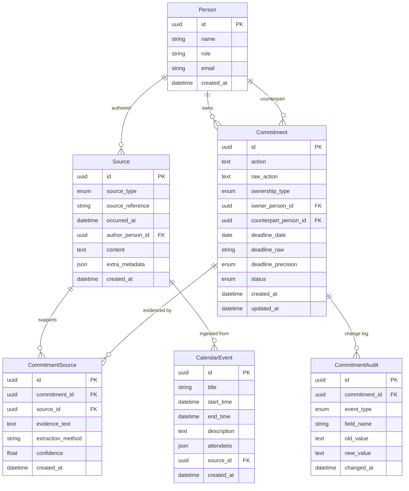

# Domain Model — Executive Productivity Agent

## Overview

The domain model captures the data structures needed to convert messy executive inputs into a structured daily action brief. It is designed around a clear separation between **original evidence** (immutable source records) and **normalized commitments** (the system's interpretation of action items).

## Entity Relationship Diagram

## Core Entities

### Person

People referenced in the assessment data — the executive (Arjun Malhotra), colleagues, external contacts.

| Field | Type | Notes |
|-------|------|-------|
| id | UUID | Primary key |
| name | String | Required, indexed |
| role | String | Optional (CEO, VP, etc.) |
| email | String | Optional, unique |

### Source

An immutable record of original evidence from the assessment data pack. **Source content must never be modified after ingestion.** Normalized data lives in Commitment.

| Field | Type | Notes |
|-------|------|-------|
| id | UUID | Primary key |
| source_type | Enum | MEETING, EMAIL, CALENDAR, VOICE_NOTE |
| source_reference | String | Human-readable label |
| occurred_at | DateTime | When the source event occurred (nullable) |
| author_person_id | UUID FK | Who created this source (nullable) |
| content | Text | Full original text — immutable |
| extra_metadata | JSON | Optional structured data (participants, headers) |

### Commitment

One canonical action/task after normalization and deduplication.

| Field | Type | Notes |
|-------|------|-------|
| id | UUID | Primary key |
| action | Text | Normalized action description |
| raw_action | Text | Original verbatim text — preserved |
| ownership_type | Enum | ARJUN, OTHER_PERSON, or UNCLEAR |
| owner_person_id | UUID FK | NULL when ownership_type = UNCLEAR |
| counterpart_person_id | UUID FK | The other party (e.g., recipient) |
| deadline_date | Date | Resolved calendar date (nullable) |
| deadline_raw | String | Original deadline text — preserved |
| deadline_precision | Enum | EXACT, APPROXIMATE, RELATIVE_UNRESOLVED, NONE |
| status | Enum | OPEN, WAITING_ON_OTHERS, COMPLETED |
| created_at | DateTime | Record creation timestamp |
| updated_at | DateTime | Last modification timestamp |

### CommitmentSource (Evidence Bridge)

Many-to-many relationship between commitments and sources. Answers: **"Why does the system believe this commitment exists?"**

| Field | Type | Notes |
|-------|------|-------|
| commitment_id | UUID FK | Links to the commitment |
| source_id | UUID FK | Links to the source evidence |
| evidence_text | Text | The specific snippet supporting the commitment |
| extraction_method | String | How extracted (e.g., "llm_extraction") |
| confidence | Float | Optional confidence score (0.0–1.0) |

### CalendarEvent

Structured calendar data — stored separately from commitments to provide timing context.

### CommitmentAudit

Lightweight change log recording meaningful state transitions (status changes, deadline updates, ownership resolution).

## Design Decisions

### Ownership States

| State | Meaning |
|-------|---------|
| `ARJUN` | Arjun is the owner — this is his action item |
| `OTHER_PERSON` | Another named person owns the action — Arjun is waiting |
| `UNCLEAR` | The source does not establish clear ownership — the system flags this rather than inventing an answer |

**Why UNCLEAR exists:** The assessment requires the system to flag ambiguous ownership rather than guessing. If a meeting transcript says "someone should handle the compliance review" without naming a person, the system marks ownership as UNCLEAR and presents this to the user for resolution.

### Commitment Status

| Status | Meaning |
|--------|---------|
| `OPEN` | Action needed — not yet completed |
| `WAITING_ON_OTHERS` | Blocked — another person must act first |
| `COMPLETED` | Done |

**Why OVERDUE is not a stored status:** Overdue is a *computed* property: `deadline_date < as_of_date AND status != COMPLETED`. Storing it would create stale data — a commitment would remain marked OVERDUE even after being completed unless something remembered to update it. Instead, the `Commitment.is_overdue(as_of_date)` method computes this deterministically at query time.

**Why UNCLEAR_OWNER is not a stored status:** Unclear ownership is captured by `OwnershipType.UNCLEAR`. A commitment with unclear ownership is still OPEN — it needs attention *because* ownership is unresolved. Mixing ownership concerns into the status enum would create confusion about what "status" means.

### Deadline Precision

| Precision | Example | deadline_date | deadline_raw |
|-----------|---------|---------------|--------------|
| `EXACT` | "by June 15" | 2025-06-15 | "by June 15" |
| `APPROXIMATE` | "early next week" | NULL | "early next week" |
| `RELATIVE_UNRESOLVED` | "tomorrow morning" | NULL | "tomorrow morning" |
| `NONE` | (no deadline mentioned) | NULL | NULL |

**Why preserve raw text:** The system must not silently convert "tomorrow" into a date without knowing the reference date. The raw text is always preserved. When the system receives an `as_of_date`, it can resolve relative references deterministically.

### Why Original Sources Are Preserved

1. **Traceability:** Every commitment must be traceable to its source evidence. The CommitmentSource bridge preserves the exact snippet and extraction method.
2. **No fact invention:** The source content is the ground truth. Normalization creates *new* records (Commitment) rather than modifying the source.
3. **Auditability:** If the system's interpretation is questioned, the original text is always available for review.
4. **Deduplication:** When the same action appears in multiple sources (e.g., discussed in a meeting AND confirmed by email), the system links both sources to one canonical commitment.

### Why Deterministic Fields Use Code, Not LLM

| Field/Logic | Handled By | Reason |
|-------------|-----------|--------|
| Deadline comparison | Python `date` math | Arithmetic is exact; LLMs hallucinate dates |
| Overdue detection | `is_overdue()` method | Deterministic: `deadline < as_of_date` |
| Status transitions | Application logic | State machine rules are well-defined |
| Ownership validation | Python enum + nullable FK | Either the source names someone or it doesn't |

The LLM's role is **language understanding**: extracting commitments from natural language, identifying who said what, and recognising relative date expressions. Once extracted, all downstream logic — deadline comparison, overdue detection, ownership validation, deduplication scoring — is handled by deterministic Python code.
